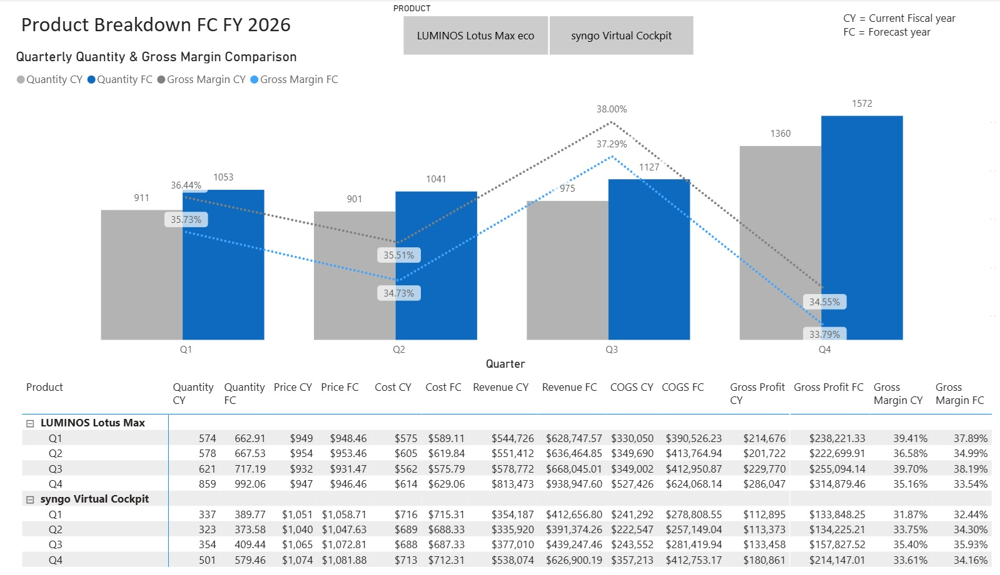

# 📊 P&L Forecast Dashboard  
Unit-Driven P&L Forecast Simulation for Controlling using Snowflake & Power BI

---

## 📌 Overview

This project demonstrates how decentralized Excel-based financial planning can be transformed into a centralized, automated P&L forecast using Snowflake and Power BI.

From a **controlling perspective**, the dashboard supports structured planning, variance analysis, and management reporting by simulating a P&L forecast based on **current unit planning per product**, enriched with historical data for quantity, price, and cost.

The approach is **simple, transparent, and explainable**, which is essential for finance controllers and management discussions.

---
## 🎯 Business Context (Controlling View)

- Snowflake is currently used only for **actuals**
- Financial planning (P&L, revenue, gross profit) is carried out **decentrally in Excel**
- Controllers face:
  - Manual effort
  - Inconsistent planning logic
  - Limited transparency and scalability

---

## 🎯 Objective

- Integrate **forecast data into Snowflake**
- Support controllers with a **unit-driven P&L forecast**
- Enrich planned units per product with **historical behavior**
- Enable consistent, auditable financial planning and analysis

---

## 🧠 Business Logic – P&L Forecast Simulation

From a controlling perspective, the forecast is built using **key P&L drivers**:

1. **Historical analysis**
   - Quarterly growth is calculated per product for:
     - Quantity (sales volume)
     - Price
     - Cost

2. **Volatility smoothing**
   - Quarterly growth rates are averaged across the full fiscal year
   - This avoids overreacting to short-term fluctuations and supports stable planning assumptions

3. **Forecast calculation**
   - Average growth rates are applied to last year’s quarterly baseline to forecast:
     - Quantity
     - Price
     - Cost

4. **P&L derivation**
   - Revenue = Quantity × Price  
   - COGS = Quantity × Cost  
   - Gross Profit = Revenue − COGS  
   - Gross Margin = Gross Profit / Revenue  

This logic enables controllers to clearly understand **which driver explains changes in profitability**.

---

## 🏗️ Technical Architecture (Snowflake)

The solution follows a layered Snowflake architecture principles:

- **Access Layer**
  - Read-only views on ingested actuals and planning inputs
  - Ensures governance and controlled data access

- **Analytics Layer**
  - SQL views implementing:
    - Growth calculations
    - Forecast logic
    - P&L derivation
  - Main working layer for controlling and analytics logic

- **Mart Layer (Conceptual)**
  - Represents the production reporting layer
  - In a real setup, validated forecast views would be published here for reporting consumption

---

## 📊 Dashboard Description (Controller-Focused)

The Power BI dashboard supports controlling tasks such as planning review and variance analysis:

- Filters by business line and product
- Quarterly total quantity comparison (Current Year vs Forecast Year)
- Weighted gross margin trends per quarter
- Detailed P&L table with:
  - Quantity
  - Price
  - Cost
  - Revenue
  - COGS
  - Gross Profit
  - Gross Margin

This allows controllers to link **sales volume development with profitability effects**.

---

## 💡 Key Insights for Controlling

- Forecast indicates strong volume growth, particularly in later quarters
- Slight margin pressure suggests increasing costs or pricing constraints
- Controllers can identify whether changes in gross profit are driven by:
  - Volume
  - Price
  - Cost
- Supports fact-based management discussions

---

## 🚀 Business Value

- Reduced dependency on decentralized Excel planning
- Consistent and transparent forecast logic
- Improved controllability and traceability
- Scalable foundation for FP&A and controlling processes

---

## 🛠️ Tools & Technologies

- Snowflake  
- SQL  
- Power BI  
- Excel (used only to simulate planning inputs)

---

## 👤 Author

Elnazossadat Hosseininia  
Data Analyst | Controlling & FP&A | Snowflake | Power BI
